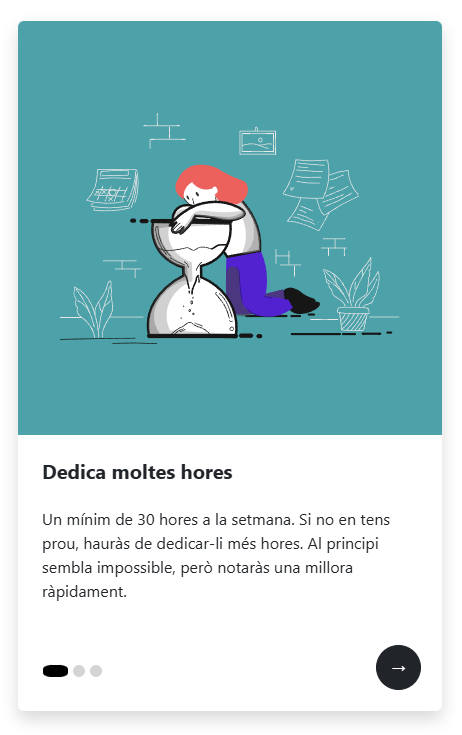

# Digital Onboarding Application

## Overview
This project involves creating a digital onboarding application using **Angular 19**. The application displays a series of phrases with associated images and background colors. Users can navigate through the phrases using "Next" and "Back" buttons. Additional features include navigation indicators (dots), responsiveness, and animations between steps.

---

## Project Objectives
1. Understand and pracice SASS and Bootstrap 5
2. Learn Angular fundamentals
3. Animations between pages

---

## Instructions

### Level 1: Core Functionality

#### Exercise 1: Basic Component Structure
1. **Create the Angular project** named `onBoarding` without routing.
2. **Define components**:
   - `Home`: Parent component.
   - `Escena`: Child component of `Home`.

3. **Component nesting**:
   - Load `Home` inside the `App` component.
   - Load `Escena` inside the `Home` component.

4. Add the following phrase in the `Escena` component template:

   ```html
   <h3>Dedica moltes hores</h3>
   Un mínim de 30 hores a la setmana. Si no en tens prou, hauràs de dedicar-li més hores. Al principi sembla impossible, però notaràs una millora ràpidament.
   ```

5. Create an interface `iStep` with the following properties:
   - `title`
   - `description`
   - `img`
   - `bgcolor`

6. Create a service `steps` to provide the phrases for the onboarding.

---

#### Exercise 2: Display Multiple Phrases
1. Define an array of onboarding phrases in the `steps` service using the `iStep` interface. Example phrases:
   ```html
   <h3>Dedica moltes hores</h3>
   Un mínim de 30 hores a la setmana. Si no en tens prou, hauràs de dedicar-li més hores. Al principi sembla impossible, però notaràs una millora ràpidament.

   <h3>Programa projectes propis</h3>
   Més val 10 hores treballant en projectes propis, que 10 hores mirant tutorials. La motivació i la implicació en el projecte ajudarà a accelerar el teu aprenentatge.

   <h3>Procura descansar</h3>
   Descansar bé i desconnectar són vitals. D'aquesta manera reduiràs l'estrès i l'ansietat. Milloraràs la teva concentració i consolidaràs el teu aprenentatge.
   ```
2. Pass the array from the `Home` component to the `Escena` component using `@Input`.
3. Render the phrases in the `Escena` component using the `*ngFor` directive.

---

#### Exercise 3: Responsive Design
1. Style the `Escena` component to be responsive and visually appealing across devices.



---

#### Exercise 4: Navigation Functionality
1. Implement two buttons in the `Escena` component:
   - **Next**: Advances to the next phrase.
   - **Back**: Goes to the previous phrase.
2. Add a `currentStep` variable to track the active phrase.
3. Display navigation indicators (dots) for each phrase at the bottom-left corner:
   - Highlight the active step with a distinct style.
   - Ensure that the first step disables the "Back" button, and the last step disables the "Next" button.

---

### Level 2: Advanced Features

#### Exercise 5: Dot Navigation
1. Allow users to click on any navigation dot to jump directly to the corresponding phrase.

---

### Level 3: Animations

#### Exercise 6: Transition Animations
1. Add animations between steps to enhance the user experience. These transitions should occur when navigating between phrases using the buttons or dots.

---

## Summary of Features
- **Dynamic Component Structure**: Modular and hierarchical setup with `Home` and `Escena`.
- **Phrase Navigation**: Next and Back buttons with step tracking.
- **Responsive Design**: Ensures compatibility across devices.
- **Dot Indicators**: Visual step navigation.
- **Smooth Animations**: Transition effects between steps.

---

## Technologies Used
- **Angular 19**: Framework for building the application.
- **HTML & CSS**: For layout and styling.
- **TypeScript**: For defining interfaces and application logic.

---

## Getting Started

1. Clone the repository.
2. Install dependencies:
   ```bash
   npm i
   ```
3. Start the development server:
   ```bash
   ng serve
   ```
   Or open the application directly:
   ```
   ng serve -o
   ```
4. Open the application at `http://localhost:4200`.
